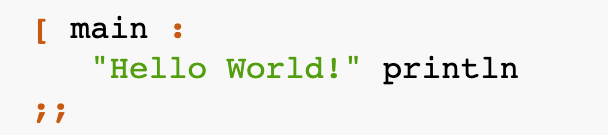

# the BUND

There are many programming languages out there, and I do dare to introduce a new one. The BUND programming language carries a legacy from a number of other languages that came before the BUND.

Bund is an interpreted high-level general-purpose programming language. It is shared a features from different “ancestors” while not being a "next generation" of any of them. Out of many BUND ancestors, I can specifically mention FORTH, Lisp and Haskell (as very distant relative). Like a FORTH, BUND is stack-based, but it is different from FORTH in respect that it is not a procedural language. It is functional. It is also different in how BUND stack machine works. Like LISP and Haskell (remember, that one is very distant relative, but relative nevertheless), BUND is functional. It is supports lambda calculus with named and anonymous lambdas. Lambda functions in BUND are functionally strict, they are taking only one parameter and always return a value. And we will discuss them in a separate tutorial. In addition to a functions, BUND offers separate concept of “operators”, which essentially functions, but taking two parameters and returning a value at all times. Like in Haskell, BUND offers a “variable immutability” and unlike in Haskell and LISP, BUND do not have a variables. Unlike LISP, BUND virtual machine operates with Stack not with List and this BUND’s feature differs it from Haskell as well.

## What the BUND is looks like ?



## How to I start ?

First, you have to install BUND interpreter.

### Compiling BUND interpreter from the source.

To compile BUND interpreter from the source, you will be needed a GO language development toolset of version 1.16 or newer.

```
go version
go version go1.16 darwin/amd64
```

Proceed to the https://github.com/vulogov/Bund and check-out most up-to date version of the BUND source code. There are number of GO packages you must have, but no worry, BUND Makefile will install them for you. Internet connectivity is required. After you check-out source code, you can execute make as

```
make
```
If after a while you will see something like that, then compilation was succesful.

```
=== Bund === [ cover-report     ]: generating coverage results...
=== Bund === [ cover-report     ]:     ./coverage/coverage.html
=== Bund === [ compile          ]: building commands:
=== Bund === [ compile          ]:     ./bin/darwin/bund
```

Your copy of interpreter will be in ./bin/<os type>/bund . You can copy it anywhere in the PATH.

### Get that HelloWorld running

Proceed to the Documentation folder and read about basics of the BUND, what your HelloWorld program is made of and how to run it.

https://github.com/vulogov/Bund/blob/master/Documentation/Bund%20_Hello%20world.pdf

## And what's next

Feel free to report any bugs or issues with BUND here https://github.com/vulogov/Bund/issues
 
